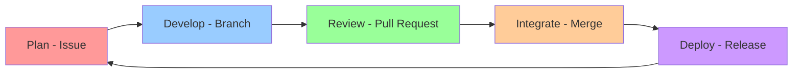
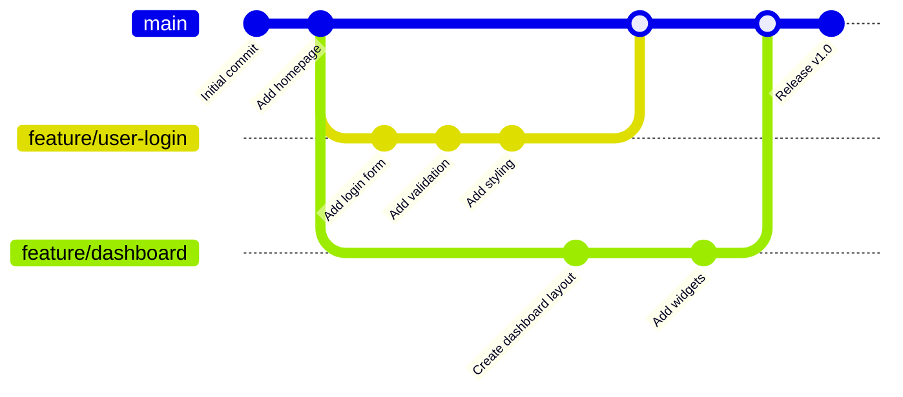

# Workshop 1: Git & GitHub Team Workflow

## 🎯 Learning Objectives

By the end of this workshop, you will:
- Understand how professional teams use Git and GitHub for collaboration
- Create and manage GitHub Issues for effective task tracking
- Use branch-based workflow to develop features safely
- Create meaningful pull requests and conduct code reviews
- Resolve merge conflicts with confidence
- Apply best practices for team communication and collaboration

---

Video recording of the workshop: *[Link will be added after live session]*

---

## 📚 Part 1: Introduction to Collaborative Development

### Why Team Workflows Matter

Imagine you're building a house with 10 other people. If everyone just starts hammering nails wherever they want, chaos ensues. You need:
- A **plan** (what to build)
- **Coordination** (who builds what)
- **Quality checks** (is it safe and well-built?)
- **Communication** (keeping everyone informed)

Software development is the same! Git and GitHub provide the tools for this coordination.

### Real-World Scenarios

**Scenario 1: The University Group Project**
Four students building a web application:
- Sarah works on the login page
- Mike builds the database
- Chen creates the navigation
- Anna designs the homepage

Without proper workflow: Everyone edits the same files, changes get overwritten, the project breaks constantly.

With proper workflow: Each person works independently, changes are reviewed, integration happens smoothly.

**Scenario 2: The Startup Team**
A team of 6 developers building a mobile app with weekly releases. They use Git workflows to:
- Track bugs and features
- Review each other's code
- Deploy confidently
- Onboard new team members

### The Git Collaboration Lifecycle



---

## 📋 Part 2: GitHub Issues - Your Team's Task Manager

### What Are GitHub Issues?

Think of issues as **smart to-do cards** that can:
- Describe a task, bug, or feature request
- Track progress and discussions
- Link to code changes
- Notify relevant team members
- Organize work with labels and milestones

### Anatomy of a Good Issue

#### Bad Issue Example ❌
```
Title: Fix bug
Body: There's a problem with the login
```

**Problems:**
- Too vague
- No context
- Can't assign priority
- Doesn't explain impact

#### Good Issue Example ✅
```markdown
Title: Login button does not respond on mobile Safari

**Description:**
When users tap the login button on mobile Safari (iOS 15+), nothing happens.
The button works fine on desktop browsers.

**Steps to Reproduce:**
1. Open app on iPhone with Safari
2. Navigate to login page
3. Enter valid credentials
4. Tap "Login" button
5. Nothing happens - no error, no navigation

**Expected Behavior:**
User should be redirected to dashboard after successful login

**Actual Behavior:**
Button appears to be tapped (visual feedback) but no action occurs

**Environment:**
- Device: iPhone 12
- OS: iOS 15.6
- Browser: Safari (latest)

**Screenshots:**
[Attach screenshot showing the issue]

**Priority:** High (affects 30% of users)
**Labels:** bug, mobile, urgent
```

**Why this is good:**
- Clear, specific title
- Detailed reproduction steps
- Expected vs actual behavior
- Environment details
- Visual evidence
- Priority indicated

### Creating Your First Issue

**Step 1: Navigate to Issues Tab**

```bash
# On GitHub repository page
https://github.com/your-username/your-repo
Click "Issues" tab → "New Issue"
```

**Step 2: Write a Descriptive Title**

Good titles follow patterns:
- `Add [feature name]` - for new features
- `Fix [specific problem]` - for bugs
- `Update [component]` - for improvements
- `Refactor [area]` - for code cleanup

Examples:
- ✅ `Add user profile page with avatar upload`
- ✅ `Fix memory leak in data processing module`
- ❌ `Update stuff`
- ❌ `Things are broken`

**Step 3: Fill Out the Body**

Use this template:

```markdown
## Description
[What needs to be done and why]

## Acceptance Criteria
- [ ] Criterion 1
- [ ] Criterion 2
- [ ] Criterion 3

## Additional Context
[Any relevant information, links, or screenshots]
```

**Step 4: Add Labels**

Common label categories:
- **Type:** `bug`, `feature`, `documentation`, `enhancement`
- **Priority:** `urgent`, `high`, `medium`, `low`
- **Status:** `in-progress`, `blocked`, `needs-review`
- **Area:** `frontend`, `backend`, `database`, `api`

**Step 5: Assign and Milestone**

- **Assign to:** Person responsible for the work
- **Milestone:** Which release or sprint this belongs to
- **Projects:** If using GitHub Projects board

### Practical Example: Planning a Feature

Let's create issues for building a "User Comments" feature:

**Issue #1: Backend API**
```markdown
Title: Create API endpoint for user comments

## Description
Build RESTful API endpoint to handle comment operations for blog posts

## Tasks
- [ ] Design comment data model (author, content, timestamp, post_id)
- [ ] Create POST /api/comments endpoint
- [ ] Create GET /api/comments/:postId endpoint  
- [ ] Create DELETE /api/comments/:commentId endpoint
- [ ] Add authentication middleware
- [ ] Write unit tests

## Dependencies
- Requires database migration (#45)

## Estimated Time: 4 hours
Labels: feature, backend, api
```

**Issue #2: Frontend Component**
```markdown
Title: Build comment section UI component

## Description
Create React component to display and submit comments

## Tasks
- [ ] Design comment card layout
- [ ] Create CommentList component
- [ ] Create CommentForm component  
- [ ] Add loading and error states
- [ ] Implement pagination
- [ ] Add accessibility features

## Dependencies
- Requires API endpoint (#46)

## Design Mockup
[Link to Figma design]

## Estimated Time: 5 hours
Labels: feature, frontend, react
```

### Issue Management Best Practices

✅ **Do:**
- Create issues early - capture ideas when you have them
- Keep issues focused - one issue = one topic
- Update issues as work progresses
- Close issues when complete
- Reference issues in commits: `git commit -m "Implement user login, fixes #23"`
- Use templates for consistency

❌ **Don't:**
- Leave issues open indefinitely
- Create duplicate issues
- Use issues for conversations (use Discussions instead)
- Forget to link related issues
- Let issues grow too large

### Issue Referencing in Git

GitHub automatically links issues when you use these keywords in commit messages or PRs:

```bash
# These keywords automatically close the issue when merged to main:
git commit -m "Fix login validation, fixes #42"
git commit -m "Add dark mode, closes #38"
git commit -m "Resolve #55 by updating dependencies"

# These keywords just reference without closing:
git commit -m "Work on #42 - add input validation"
git commit -m "See #38 for context"
```

---

## 🌿 Part 3: Branch-Based Workflow

### Understanding Branches

Think of branches as **parallel universes** for your code:
- The `main` branch is your stable, production-ready code
- Feature branches are experimental spaces where you build new things
- When ready, you merge the feature back into main

**The Golden Rule:** Never commit directly to `main` in a team setting!

### Branch Workflow Visualization



### Branch Naming Conventions

Good branch names are:
- Descriptive
- Lowercase with hyphens
- Prefixed by type

**Common Prefixes:**
- `feature/` - new features
- `fix/` or `bugfix/` - bug fixes
- `hotfix/` - urgent production fixes
- `refactor/` - code improvements
- `docs/` - documentation updates
- `test/` - test additions

**Examples:**
```bash
# ✅ Good
feature/user-authentication
fix/memory-leak-in-parser
hotfix/security-vulnerability
refactor/database-queries
docs/api-documentation

# ❌ Bad
johns-branch
new-stuff
fix
branch-2
asdf123
```

### Creating and Working with Branches

**Step 1: Ensure you're up to date**

```bash
# Switch to main branch
git checkout main

# Pull latest changes
git pull origin main
```

**Step 2: Create a new branch**

```bash
# Create and switch to new branch
git checkout -b feature/user-profile

# This is shorthand for:
# git branch feature/user-profile
# git checkout feature/user-profile
```

**Step 3: Verify you're on the right branch**

```bash
# Check current branch
git branch
# Output:
#   main
# * feature/user-profile  ← asterisk shows current branch

# Or use:
git status
# Output: On branch feature/user-profile
```

**Step 4: Make your changes**

```bash
# Edit files
echo "console.log('Building user profile');" > profile.js

# See what changed
git status
# Output: modified: profile.js

# Add changes
git add profile.js

# Commit with descriptive message
git commit -m "Add user profile page structure"
```

**Step 5: Push your branch to GitHub**

```bash
# First time pushing a new branch:
git push -u origin feature/user-profile

# Subsequent pushes:
git push
```

### Working on Multiple Features

```bash
# Start working on feature A
git checkout -b feature/dark-mode
# ... make some changes ...
git add .
git commit -m "Add dark mode toggle"

# Need to switch to feature B urgently
git checkout main
git checkout -b fix/critical-bug
# ... fix the bug ...
git add .
git commit -m "Fix critical authentication bug"
git push -u origin fix/critical-bug

# Go back to feature A
git checkout feature/dark-mode
# ... continue working ...
```

### Keeping Your Branch Updated

When working on a long-lived feature branch, the main branch may advance:

```bash
# On your feature branch
git checkout feature/user-profile

# Option 1: Merge main into your branch
git merge main
# Resolve any conflicts, then:
git push

# Option 2: Rebase your branch on main (cleaner history)
git rebase main
# Resolve any conflicts, then:
git push --force-with-lease
```

⚠️ **Warning:** Use rebase carefully! Only rebase branches that only you are working on.

### Branch Protection Rules

Professional teams protect the main branch:

**On GitHub:**
1. Go to Settings → Branches
2. Add rule for `main`
3. Enable:
   - ✅ Require pull request reviews
   - ✅ Require status checks to pass
   - ✅ Require branches to be up to date
   - ✅ Restrict who can push

This forces developers to use pull requests instead of direct commits.

---

## 🔄 Part 4: Pull Requests - The Code Review Gateway

### What Is a Pull Request?

A Pull Request (PR) is a formal way to say:
> "Hey team, I've made some changes on my branch. Can you review them before I merge into main?"

**PR Flow:**
1. You create a PR from your branch
2. Team members review your code
3. You address feedback
4. PR gets approved
5. Code merges into main

### Creating Your First Pull Request

**Step 1: Push your branch**

```bash
git push -u origin feature/user-profile
```

**Step 2: On GitHub, create the PR**

Navigate to your repository and you'll see:
```
feature/user-profile had recent pushes
[Compare & pull request]  ← Click this
```

**Step 3: Fill out the PR template**

**Title:** Should be clear and action-oriented
```markdown
✅ Add user profile page with avatar upload
✅ Fix authentication bug in login flow
❌ Updates
❌ Changes to code
```

**Description:** Tell the story of your changes

```markdown
## What does this PR do?
Adds a user profile page where users can view and edit their information,
including uploading a custom avatar.

## Why is this needed?
Resolves #42 - users have been requesting profile customization

## What changed?
- Added ProfilePage.jsx component
- Created avatar upload functionality with drag-and-drop
- Added validation for image files (max 5MB, jpg/png only)
- Updated routing to include /profile
- Added unit tests for profile component

## How to test?
1. Log in to the application
2. Click "Profile" in navigation
3. Try uploading an avatar (drag or click to browse)
4. Edit name and bio
5. Click "Save Changes"
6. Verify changes persist after refresh

## Screenshots


## Checklist
- [x] Code follows project style guidelines
- [x] Tests pass locally
- [x] Added unit tests for new functionality
- [x] Updated documentation
- [x] No console errors or warnings
```

**Step 4: Request reviewers**

On the right sidebar:
- **Reviewers:** Select 1-2 teammates
- **Assignees:** Add yourself
- **Labels:** Add relevant labels (feature, frontend, etc.)
- **Projects:** Add to project board if applicable

### Code Review: As a Reviewer

When reviewing someone else's PR:

**What to Look For:**

✅ **Functionality:**
- Does the code do what it claims?
- Are there edge cases not handled?
- Does it match requirements?

✅ **Code Quality:**
- Is it readable and maintainable?
- Are variables and functions well-named?
- Is there unnecessary complexity?
- Are there code smells?

✅ **Testing:**
- Are there adequate tests?
- Do tests cover edge cases?
- Do all tests pass?

✅ **Documentation:**
- Are complex parts commented?
- Is README updated if needed?
- Are API changes documented?

✅ **Security:**
- Are user inputs validated?
- Are credentials properly handled?
- Are there SQL injection risks?

**How to Leave Comments:**

```markdown
# 💡 Suggestion (nice to have)
Consider extracting this logic into a separate function for reusability

# ⚠️ Concern (should address)
This endpoint isn't validating user authentication.
We should add auth middleware here.

# ❓ Question (seeking clarification)
Why did we choose setTimeout here instead of using async/await?

# 👍 Praise (positive feedback)
Great error handling! This will make debugging much easier.
```

**Types of Reviews:**

**Comment:** Leave feedback without approving or rejecting
```
"This looks good overall, but I have some questions..."
```

**Approve:** You think it's ready to merge
```
"LGTM! (Looks Good To Me) Well-tested and documented."
```

**Request Changes:** Issues must be addressed before merging
```
"We need to fix the security vulnerability before merging."
```

### Code Review: Responding to Feedback

When someone reviews your PR:

**✅ Good Responses:**

```markdown
# To a suggestion:
"Great idea! I've refactored to use a separate function. Check out commit abc123"

# To a concern:
"You're absolutely right - I've added auth middleware in commit def456.
Thanks for catching this!"

# To a question:
"I used setTimeout because of [specific reason]. However, you make
a good point - async/await would be cleaner. Updated!"

# To praise:
"Thanks! I learned that pattern from [resource]."
```

**❌ Defensive Responses:**

```markdown
# Too defensive:
"This is how I always do it and it works fine."

# Dismissive:
"That's not important right now."

# Aggressive:
"Why are you criticizing my code?"
```

**Remember:** Code review is about the code, not you. It's a collaborative process to make the code better!

### Updating Your PR

When you make changes based on feedback:

```bash
# Make the changes in your local branch
git checkout feature/user-profile

# Edit files based on feedback
# Then commit and push

git add .
git commit -m "Address review feedback: add auth middleware"
git push

# The PR automatically updates on GitHub!
```

### Merging Strategies

When your PR is approved, you have merge options:

**1. Merge Commit (default)**
```bash
# Creates a merge commit
Keeps all commits from feature branch
History: A -- B -- C -- M (merge)
```

**2. Squash and Merge**
```bash
# Combines all commits into one
Clean main branch history
History: A -- B -- C → Single commit X
```

**3. Rebase and Merge**
```bash
# Replays commits on main
Linear history, no merge commit
History: A -- B -- C -- D
```

Most teams use **Squash and Merge** for clean history.

### After Merging

```bash
# Switch back to main
git checkout main

# Pull the merged changes
git pull origin main

# Delete the merged branch locally
git branch -d feature/user-profile

# Delete on, GitHub (usually automated)
git push origin --delete feature/user-profile
```

---

## ⚔️ Part 5: Merge Conflicts - Don't Panic!

### What Are Merge Conflicts?

A merge conflict occurs when:
1. You and a teammate edit the same lines in the same file
2. Git can't automatically decide which changes to keep
3. Git asks YOU to decide

**Think of it like two people editing a Google Doc simultaneously** - sometimes changes overlap and conflict.

### Understanding Conflict Markers

When a conflict occurs, Git marks the file like this:

```javascript
function login(username, password) {
<<<<<<< HEAD
    // Your changes (in current branch)
    const hashedPassword = sha256(password);
    return authenticate(username, hashedPassword);
=======
    // Their changes (in branch being merged)
    const encryptedPassword = bcrypt.hash(password);
    return auth.verify(username, encryptedPassword);
>>>>>>> feature/enhanced-security
}
```

**Breaking it down:**
- `<<<<<<< HEAD` - Start of your changes
- `=======` - Divider between versions
- `>>>>>>> branch-name` - End of their changes

### Resolving Conflicts: Step by Step

**Scenario:** You and a teammate both edited `app.js`

**Step 1: Attempt the merge**

```bash
git checkout main
git pull origin main
git checkout feature/my-feature
git merge main

# Output:
# Auto-merging app.js
# CONFLICT (content): Merge conflict in app.js
# Automatic merge failed; fix conflicts and then commit the result.
```

**Step 2: Check which files have conflicts**

```bash
git status

# Output:
# both modified:   app.js
```

**Step 3: Open the file and examine conflicts**

```javascript
// app.js
function calculateTotal(items) {
<<<<<<< HEAD
    // Your version: using reduce
    return items.reduce((sum, item) => sum + item.price, 0);
=======
    // Their version: using forEach
    let total = 0;
    items.forEach(item => {
        total += item.price;
    });
    return total;
>>>>>>> main
}
```

**Step 4: Decide what to keep**

You have three options:

**Option A: Keep your changes**
```javascript
function calculateTotal(items) {
    return items.reduce((sum, item) => sum + item.price, 0);
}
```

**Option B: Keep their changes**
```javascript
function calculateTotal(items) {
    let total = 0;
    items.forEach(item => {
        total += item.price;
    });
    return total;
}
```

**Option C: Combine both (create a new solution)**
```javascript
function calculateTotal(items) {
    // Use reduce for cleaner code, but add type checking
    return items.reduce((sum, item) => {
        return sum + (typeof item.price === 'number' ? item.price : 0);
    }, 0);
}
```

**Step 5: Remove conflict markers**

Make sure to remove ALL of these:
- `<<<<<<< HEAD`
- `=======`
- `>>>>>>> branch-name`

**Step 6: Test your changes**

```bash
# Run tests
npm test

# Try running the app
npm start

# Make sure nothing broke!
```

**Step 7: Mark as resolved**

```bash
# Add the resolved file
git add app.js

# Check status
git status
# Output: All conflicts fixed but you are still merging.

# Complete the merge
git commit -m "Resolve merge conflict in calculateTotal function"

# Push
git push
```

### Preventing Conflicts

**Best Practices:**

✅ **Pull frequently**
```bash
# Start each day by pulling
git checkout main
git pull origin main
```

✅ **Keep features small**
- Smaller PRs merge faster
- Less time for conflicts to develop

✅ **Communicate with your team**
- "I'm working on the authentication module"
- Prevents two people working on the same code

✅ **Use feature branches**
- Isolate changes
- Merge regularly from main

✅ **Modularize your code**
- One person per file when possible
- Clear module boundaries

### Using VS Code for Conflict Resolution

VS Code provides a great UI for conflicts:

```javascript
<<<<<<< HEAD (Current Change)
const result = method1();
||||||| common ancestor
const result = oldMethod();
=======
const result = method2();
>>>>>>> feature-branch (Incoming Change)

[Accept Current Change] [Accept Incoming Change] [Accept Both Changes] [Compare Changes]
```

Click the buttons above the conflict to:
- **Accept Current Change** - Keep your version
- **Accept Incoming Change** - Keep their version  
- **Accept Both Changes** - Keep both (sometimes works!)
- **Compare Changes** - See side-by-side diff

### Complex Conflicts

Sometimes conflicts span multiple blocks:

```javascript
class UserService {
<<<<<<< HEAD
    constructor(db) {
        this.database = db;
        this.cache = new Cache();
    }
    
    async findUser(id) {
        return this.database.users.findOne({ id });
=======
    constructor(database, logger) {
        this.db = database;
        this.logger = logger;
    }
    
    async getUser(userId) {
        this.logger.info(`Fetching user ${userId}`);
        return this.db.query('SELECT * FROM users WHERE id = ?', [userId]);
>>>>>>> main
    }
}
```

**Strategy for complex conflicts:**

1. **Understand both versions**
   - What was each person trying to accomplish?
   - Why did they make these changes?

2. **Choose a base approach**
   - Which structure makes more sense?
   - Consider the broader codebase

3. **Integrate good parts from both**
   - Maybe you want the new constructor AND the caching
   - Combine thoughtfully

4. **Test thoroughly**
   - Complex merges are risky
   - Run all tests
   - Manual testing in important areas

### When to Ask for Help

🆘 **Get help if:**
- You don't understand what the other code does
- The conflict affects critical functionality
- Multiple files have conflicts
- You're unsure which approach is better
- Tests are failing after resolution

**How to ask:**
```markdown
"Hey @teammate, I'm resolving conflicts in auth.js from your security branch.
I see you refactored the authentication flow. Can you help me understand
the reasoning so I can merge correctly?"
```

---

## 🤝 Part 6: Team Collaboration Best Practices

### Communication is Key

**Daily Standup Questions:**
1. What did I complete yesterday?
2. What will I work on today?
3. Are there any blockers?

**In GitHub Issues:**
```markdown
# Keep teammates updated
"Starting work on this today 🚀"
"PR ready for review: #123"
"Blocked waiting for API endpoint - see #45"
```

### Commit Message Conventions

Good commit messages help your team understand history:

**Format:**
```
<type>: <subject>

<body>

<footer>
```

**Types:**
- `feat:` - New feature
- `fix:` - Bug fix
- `docs:` - Documentation changes
- `style:` - Code style (formatting, no logic change)
- `refactor:` - Code restructuring
- `test:` - Adding tests
- `chore:` - Maintenance tasks

**Examples:**

```bash
# Good commits:
git commit -m "feat: add user profile page with avatar upload"

git commit -m "fix: resolve memory leak in data processing
- Added proper cleanup in useEffect
- Removed event listeners on unmount
- Closes #87"

git commit -m "refactor: extract validation logic to separate module
Makes code more testable and reusable"

# Bad commits:
git commit -m "changes"
git commit -m "fix bug"
git commit -m "asdf"
git commit -m "updated files"
```

### PR Size Guidelines

**Good PR:** 200-400 lines changed
- Easy to review in 15-30 minutes
- Clear scope
- Less likely to have conflicts

**Too Small:** < 50 lines
- Unless it's a bug fix or documentation
- Consider combining related small changes

**Too Large:** > 800 lines
- Hard to review thoroughly
- Higher chance of bugs slipping through
- Consider breaking into smaller PRs

### Code Review Etiquette

**As a Reviewer:**

✅ **Be kind and constructive**
```markdown
"Consider using a Set here for O(1) lookup instead of O(n)"
vs
"This is slow and wrong"
```

✅ **Explain your reasoning**
```markdown
"We should validate inputs because..."
vs
"Add validation"
```

✅ **Distinguish between must-fix and nice-to-have**
```markdown
"⚠️ Must fix: Security vulnerability in auth flow"
"💡 Suggestion: Could extract this to a helper function"
```

✅ **Praise good work**
```markdown
"Great test coverage! Really appreciate the edge cases you covered."
```

**As an Author:**

✅ **Be receptive to feedback**
```markdown
"Great catch! Fixed in commit abc123"
vs
"It works fine for me"
```

✅ **Ask for clarification**
```markdown
"Could you help me understand why approach B is better here?"
```

✅ **Don't take it personally**
- Feedback is about code quality, not your worth
- Everyone's code can improve

### Team Workflow Example

**Real-world scenario:** Building a todo app feature

**Monday:**
```
Sarah creates issue: "Add task sorting feature"
- Assigns to herself
- Adds to Sprint 3 milestone
- Labels: feature, frontend

Sarah: git checkout -b feature/task-sorting
- Implements sorting UI
- Writes tests
- Commits: "feat: add task sorting dropdown"
```

**Tuesday:**
```
Sarah: git push -u origin feature/task-sorting
- Creates PR #156
- Requests review from Mike and Chen

Mike reviews:
- "Looking good! One concern about sort performance with large lists"
- Suggests caching sorted results

Sarah addresses feedback:
- Commits: "perf: add memoization to sort function"
- Comments: "Great idea! Added React.useMemo"
```

**Wednesday:**
```
Chen reviews:
- "LGTM! Tests look comprehensive"
- Approves PR

Mike approves after seeing perf fix

Sarah merges PR:
- Uses "Squash and Merge"
- Deletes feature branch
- Closes issue #142 automatically
```

### When Things Go Wrong

**Accidentally committed to main:**
```bash
# Create a branch from this commit
git branch feature/accidental-work

# Reset main to before your commits
git reset --hard origin/main

# Switch to the new branch and continue
git checkout feature/accidental-work
```

**Need to undo last commit:**
```bash
# Keep changes, undo commit
git reset --soft HEAD~1

# Discard changes completely
git reset --hard HEAD~1
```

**Pushed something wrong to feature branch:**
```bash
# Fix it locally
git reset --hard <good-commit-hash>

# Force push (your feature branch only!)
git push --force-with-lease
```

⚠️ **Never force push to main or shared branches!**

---

## 📊 Part 7: Tools and Automation

### GitHub CLI

Install GitHub CLI for faster workflows:

```bash
# Install
brew install gh

# Authenticate
gh auth login

# Create PR from command line
gh pr create --title "Add user profile" --body "Implements #42"

# Check out PR locally
gh pr checkout 123

# Review PR
gh pr review --approve

# Merge PR
gh pr merge 123 --squash
```

### Git Aliases

Make your life easier:

```bash
# Add to ~/.gitconfig
[alias]
    co = checkout
    br = branch
    ci = commit
    st = status
    unstage = reset HEAD --
    last = log -1 HEAD
    visual = log --graph --oneline --all

# Usage
git co main
git br feature/new-feature
git st
```

### GitHub Actions for PR Checks

Automate testing and linting:

```yaml
# .github/workflows/pr-checks.yml
name: PR Checks

on: [pull_request]

jobs:
  test:
    runs-on: ubuntu-latest
    steps:
      - uses: actions/checkout@v2
      - name: Install dependencies
        run: npm install
      - name: Run tests
        run: npm test
      - name: Run linter
        run: npm run lint
```

Now every PR automatically runs tests!

### VS Code Extensions

**GitLens:**
- See who wrote each line
- View commit history inline
- Compare changes easily

**GitHub Pull Requests:**
- Review PRs directly in VS Code
- Comment on code without leaving editor
- See PR status and checks

---

## 🎯 Summary & Key Takeaways

### The Collaborative Development Workflow

1. **Plan** with GitHub Issues
   - Create clear, detailed issues
   - Use labels and assignments
   - Link related issues

2. **Develop** on feature branches
   - Never commit directly to main
   - Use descriptive branch names
   - Commit often with good messages

3. **Review** through Pull Requests
   - Write comprehensive PR descriptions
   - Request reviewers
   - Address feedback professionally

4. **Integrate** by merging
   - Ensure tests pass
   - Get approvals
   - Squash and merge for clean history

5. **Repeat** for next feature

### Essential Commands Cheat Sheet

```bash
# Branch workflow
git checkout main
git pull origin main
git checkout -b feature/my-feature
git add .
git commit -m "feat: descriptive message"
git push -u origin feature/my-feature

# Keeping branch updated
git checkout feature/my-feature
git merge main  # or: git rebase main

# After PR merged
git checkout main
git pull origin main
git branch -d feature/my-feature
```

### Best Practices Checklist

✅ **Issues:**
- [ ] Write clear, specific titles
- [ ] Include reproduction steps for bugs
- [ ] Add relevant labels and assignees
- [ ] Link related issues

✅ **Branches:**
- [ ] Use feature/fix/docs prefixes
- [ ] Keep branches short-lived
- [ ] Pull from main frequently
- [ ] Delete after merging

✅ **Commits:**
- [ ] Write descriptive messages
- [ ] Make atomic commits (one logical change)
- [ ] Use conventional commit format
- [ ] Reference issues when relevant

✅ **Pull Requests:**
- [ ] Fill out PR template completely
- [ ] Keep PRs focused and reasonably sized
- [ ] Request appropriate reviewers
- [ ] Address feedback promptly
- [ ] Ensure CI checks pass

✅ **Code Review:**
- [ ] Review promptly (within 24 hours)
- [ ] Be constructive and kind
- [ ] Explain reasoning for suggestions
- [ ] Approve when satisfied

---

## 📚 Additional Resources

### Official Documentation
- [GitHub Guides](https://guides.github.com/)
- [Git Documentation](https://git-scm.com/doc)
- [GitHub Flow](https://guides.github.com/introduction/flow/)

### Interactive Learning
- [Learn Git Branching](https://learngitbranching.js.org/) - Visual Git tutorial
- [GitHub Learning Lab](https://lab.github.com/) - Hands-on tutorials

### Books
- [Pro Git](https://git-scm.com/book/en/v2) - Free online book
- [GitHub Essential Training](https://www.linkedin.com/learning/github-essential-training)

### Tools
- [GitHub Desktop](https://desktop.github.com/) - GUI Git client
- [GitKraken](https://www.gitkraken.com/) - Visual Git tool
- [Oh My Zsh](https://ohmyz.sh/) - Git-friendly terminal

### Cheat Sheets
- [GitHub Git Cheat Sheet](https://education.github.com/git-cheat-sheet-education.pdf)
- [Atlassian Git Cheat Sheet](https://www.atlassian.com/git/tutorials/atlassian-git-cheatsheet)

---

## 🚀 Next Steps

1. **Practice:** Complete the [hands-on lab exercises](../exercises/hands-on-lab.md)
2. **Apply:** Use this workflow in your next project
3. **Explore:** Try GitHub Projects for project management
4. **Continue Learning:** Join us for Workshop 2: Code Review & PR Best Practices

---

**Congratulations!** You now have the knowledge to collaborate effectively with development teams using Git and GitHub! 🎉

---

**Previous:** [Workshop README](../README.md) | **Next:** [Hands-On Lab](../exercises/hands-on-lab.md)
